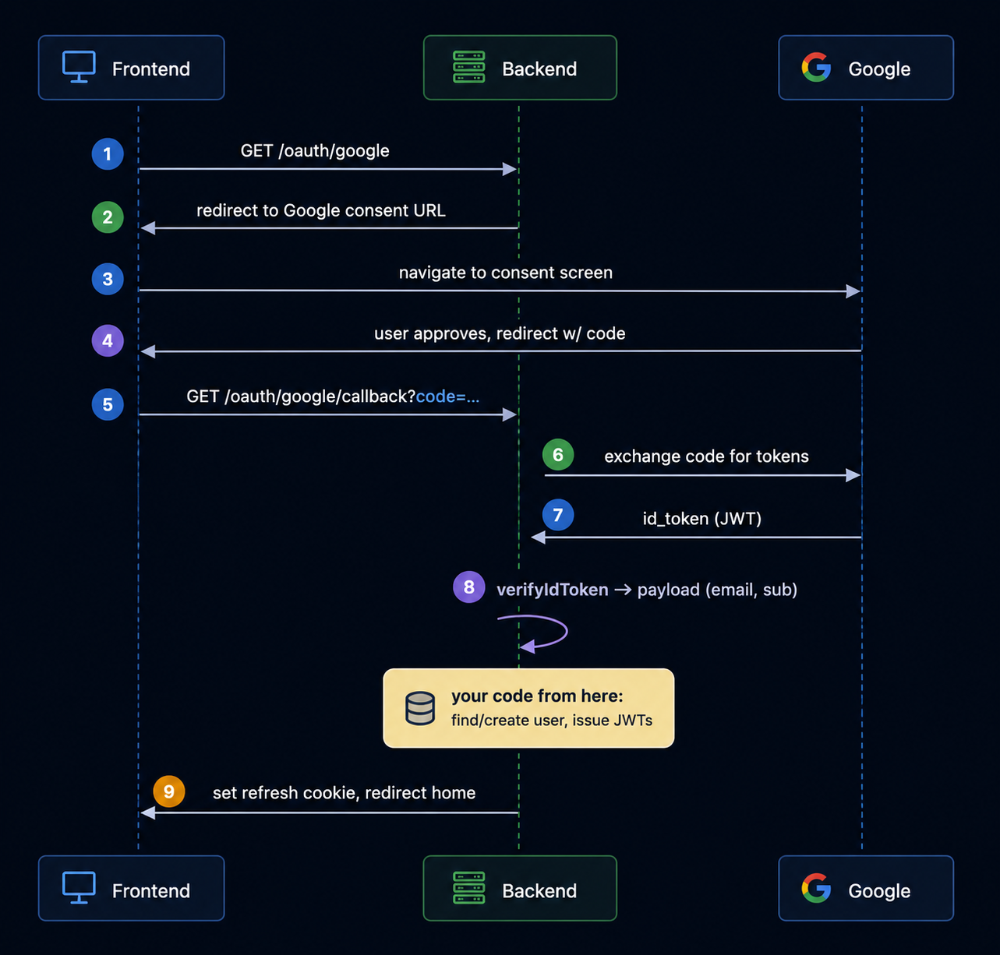
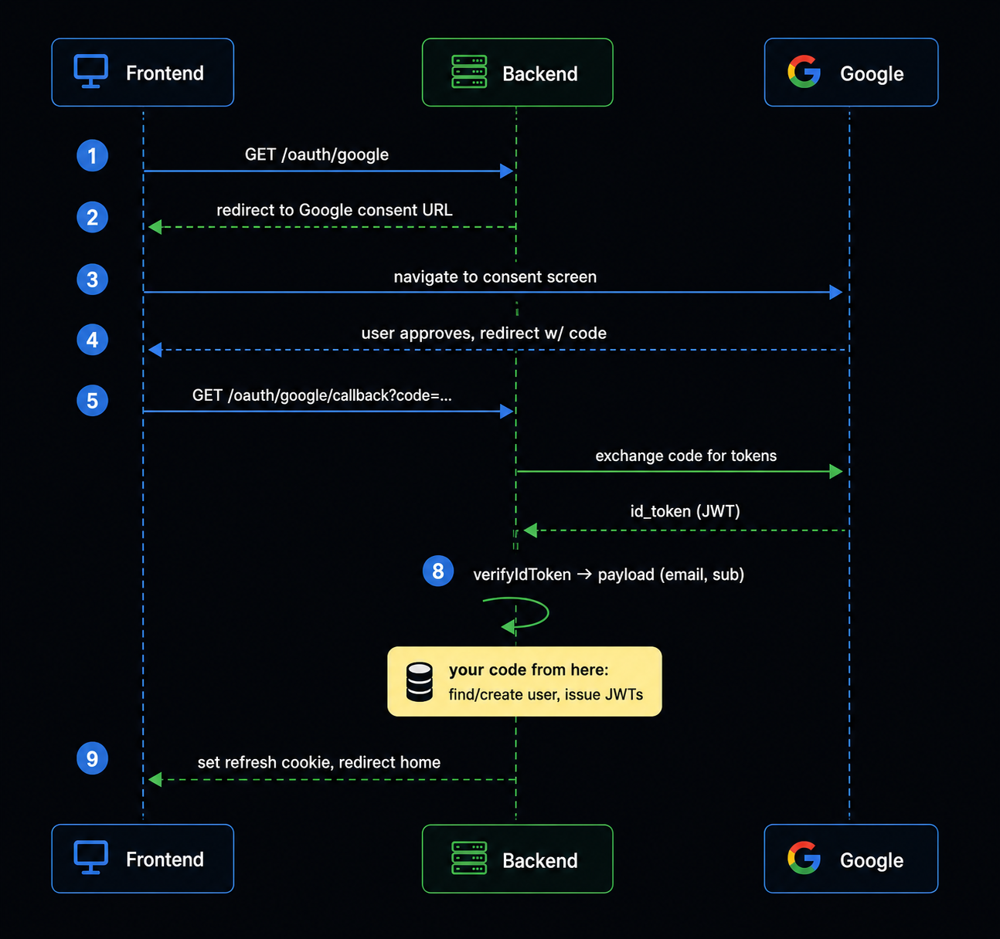

# Google OAuth (redirect flow)



## Install

```bash
npm install google-auth-library
```

## Config

```
GOOGLE_CLIENT_ID=
GOOGLE_CLIENT_SECRET=
GOOGLE_REDIRECT_URI=http://localhost:5000/api/oauth/google/callback
```

Must exactly match the redirect URI registered in Google Cloud Console.

```typescript
const googleClient = new OAuth2Client(
  process.env.GOOGLE_CLIENT_ID,
  process.env.GOOGLE_CLIENT_SECRET,
  process.env.GOOGLE_REDIRECT_URI,
);
```

## Routes

```typescript
router.get('/oauth/google', oAuthController.initiateGoogleAuth);
router.get('/oauth/google/callback', oAuthController.googleCallback);
```

## 1. Initiate — build consent URL, redirect

```typescript
initiateGoogleAuth(req, res) {
  const url = googleClient.generateAuthUrl({
    access_type: 'online',
    scope: ['profile', 'email'],
    prompt: 'select_account',
  });
  res.redirect(url);
}
```

## 2. Extract code (or error) from callback query

```typescript
async googleCallback(req, res) {
  const { code, error } = req.query;

  if (error) return res.redirect(`${clientUrl}/login?error=oauth_denied`);
  if (!code) return res.redirect(`${clientUrl}/login?error=oauth_failed`);

  try {
    // steps 3-5 below
  } catch (err) {
    return res.redirect(`${clientUrl}/login?error=oauth_failed`);
  }
}
```

## 3. Exchange code for tokens

```typescript
const { tokens } = await googleClient.getToken(code);
if (!tokens.id_token) throw new Error('no id_token');
```

## 4. Verify id_token

```typescript
const ticket = await googleClient.verifyIdToken({
  idToken: tokens.id_token,
  audience: process.env.GOOGLE_CLIENT_ID,
});
```

## 5. Get payload

```typescript
const payload = ticket.getPayload();
// { email, given_name, sub, ... }

// from here it's up to you, e.g.:
// - resolveOrCreateOAuthUser({ provider: 'GOOGLE', providerAccountId: payload.sub, email: payload.email, firstName: payload.given_name })
//   -> 3 branches: existing OAuthAccount / existing User by email (link) / neither (create User + OAuthAccount in a transaction)
// - tokenService.generateRefreshToken(user)
// - res.cookie('refreshToken', refreshToken, { httpOnly: true })
// - res.redirect(clientUrl)
```

## Gotchas

- `redirect_uri` mismatch → Google shows its own error page before ever hitting your callback.
- Never wrap `googleCallback` in a JSON-error-handling middleware (`asyncHandler`/`next(err)`) — every failure path must end in `res.redirect`, not a thrown error.
- Don't put the access token in the redirect URL query string — set the refresh cookie only, redirect home, let your existing "get current user" bootstrap fetch the access token.

---

# GitHub OAuth (redirect flow)



## Install

```bash
npm install axios
```

## Config

```
GITHUB_CLIENT_ID=
GITHUB_CLIENT_SECRET=
GITHUB_REDIRECT_URI=http://localhost:5000/api/oauth/github/callback
```

## Routes

```typescript
router.get('/oauth/github', oAuthController.initiateGithubAuth);
router.get('/oauth/github/callback', oAuthController.githubCallback);
```

## 1. Initiate — build consent URL with CSRF state, redirect

```typescript
initiateGithubAuth(req, res) {
  const state = generateOAuthState();

  const githubAuthUrl = 'https://github.com/login/oauth/authorize?' + new URLSearchParams({
    client_id: config.githubClientId,
    redirect_uri: config.githubRedirectUri,
    scope: 'user:email',
    state,
  }).toString();

  res.redirect(githubAuthUrl);
}
```

## 2. Extract code + state from callback query

```typescript
async githubCallback(req, res) {
  const { code, state } = req.query;
  try {
    if (!code) throw new BadRequestError('Missing OAuth code.');
    if (!state) throw new BadRequestError('Missing OAuth state.');
    verifyOAuthState(state);

    // step 3-4 below
  } catch (err) {
    return res.redirect(`${clientUrl}/login?error=oauth_failed`);
  }
}
```

## 3. Exchange code for access_token

```typescript
const { data } = await axios.post(
  'https://github.com/login/oauth/access_token',
  {
    client_id: config.githubClientId,
    client_secret: config.githubClientSecret,
    code,
    redirect_uri: config.githubRedirectUri,
  },
  { headers: { Accept: 'application/json' } },
);
```

## 4. Get profile + verified primary email (two calls, parallel)

```typescript
const [githubUser, emails] = await Promise.all([
  axios.get('https://api.github.com/user', {
    headers: { Authorization: `Bearer ${data.access_token}` },
  }),
  axios.get('https://api.github.com/user/emails', {
    headers: { Authorization: `Bearer ${data.access_token}` },
  }),
]);

const primaryEmail = emails.data.find((e) => e.primary && e.verified);
if (!primaryEmail) throw new BadRequestError('No verified primary email found.');

const firstName = githubUser.data.name?.trim().split(/\s+/)[0] ?? githubUser.data.login;

// from here it's the same as Google:
// - resolveOrCreateOAuthUser({ provider: 'GITHUB', providerAccountId: String(githubUser.data.id), email: primaryEmail.email, firstName })
// - tokenService.generateRefreshToken(user)
// - res.cookie('refreshToken', refreshToken, { httpOnly: true })
// - res.redirect(clientUrl)
```

## Gotchas

- GitHub emails can be private → `GET /user` returns `email: null`, must hit `/user/emails` and pick `primary && verified`.
- Requires `state` param CSRF protection (Google's flow above skipped this — worth adding there too for consistency).
- No `id_token`/JWT like Google — profile comes from separate authenticated REST calls, not decoded from a token.
